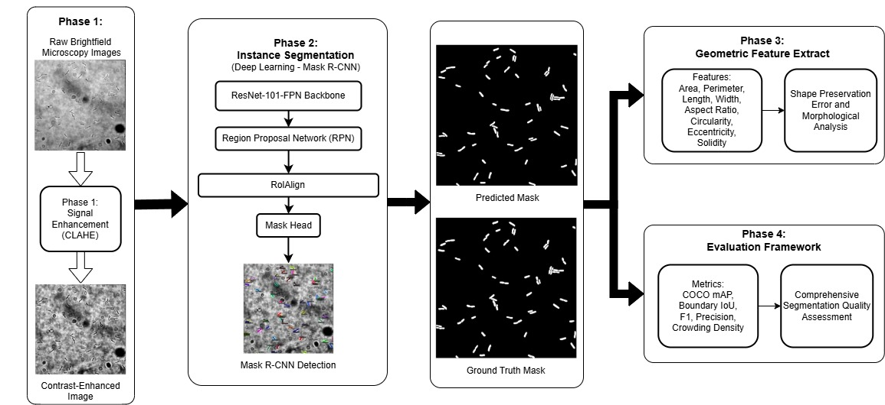

# 🦠 E. coli Instance Segmentation: Geometric & Boundary-Aware Framework

This repository contains the codebase and evaluation framework for the Master's dissertation: **"Instance Segmentation of Deformable Bacterial Cells using Mask R-CNN: A Geometric Shape and Boundary-Aware Evaluation Framework."** It provides an end-to-end deep learning pipeline for segmenting unstained *Escherichia coli* (E. coli) cells in brightfield microscopy, heavily focusing on **Boundary IoU** and **Geometric Shape Analysis** to expose failure modes that standard COCO metrics hide.

---

## 🔬 Overview

Instance segmentation of biological objects in brightfield microscopy is notoriously difficult due to low contrast, irregular morphology, and dense spatial clustering. While standard region-overlap metrics (like mAP and Region IoU) often suggest high performance, they are dominated by interior pixels and mask severe boundary contraction errors at the cell edges.

This project introduces a **4-Phase Pipeline** designed to rigorously evaluate these hidden errors:
1. **Signal Enhancement:** Contrast Limited Adaptive Histogram Equalization (CLAHE) to boost local boundary gradients.
2. **Instance Segmentation:** A ResNet-101-FPN Mask R-CNN architecture trained via Detectron2, with anchor boxes customized for highly elongated rod morphotypes.
3. **Geometric Feature Extraction:** Morphological analysis comparing ground truth vs. predicted Area, Perimeter, Aspect Ratio, Circularity, Eccentricity, and Solidity.
4. **Boundary-Aware Evaluation:** Custom implementation of Boundary IoU alongside spatial crowding/density analysis.

### 🏗️ Pipeline Architecture

 

---

## 📊 Key Findings & Results

Our multi-metric evaluation on the [DeepBacs E. coli Brightfield dataset](https://zenodo.org/records/5550935) reveals a critical **32.3 percentage point gap** between interior region accuracy and actual boundary delineation.

| Metric | Value | Interpretation |
| :--- | :--- | :--- |
| **mAP (0.50:0.95)** | 59.21% | Strong baseline detection performance for challenging brightfield data. |
| **AP50** | 82.56% | Highly successful at localizing ~82% of all cells. |
| **Mean Region IoU** | 0.790 | Excellent interior pixel classification. |
| **Boundary IoU** | **0.467** | **Exposes severe boundary contraction at the cell edges.** |

### 🧬 Geometric Shape Preservation
Despite boundary contraction causing a **29.4% underestimation in overall cell area**, the model successfully preserves scale-independent biological morphotypes:
* **Eccentricity Error:** Only **0.51%** (Successfully preserves rod-shaped morphology).
* **Solidity Error:** Only **2.88%** (Successfully preserves cell convexity).

### 🔍 Visual Pipeline Results

 

---

## 🚀 Getting Started (Colab Environment)

This pipeline is optimized for execution in **Google Colab** using an NVIDIA T4 GPU.

**1. Dataset Preparation:**
* Download the E. coli Brightfield dataset from [Zenodo (ID: 5550935)](https://zenodo.org/records/5550935).
* Upload the dataset to your Google Drive. The notebook automatically handles the conversion of `RoiMap` masks into COCO-compatible Detectron2 dictionaries.

**2. Running the Pipeline:**
* Open `DeepBacs_E_Coli_segmentation.ipynb` in Google Colab.
* Mount your Google Drive in the first cell.
* **Phase 1 & 2:** Run the training cells. The model utilizes transfer learning from a COCO-pretrained `mask_rcnn_R_101_FPN_3x` backbone.
* **Phase 3 & 4:** Run the evaluation cells to extract standard COCO metrics, Boundary IoU, and population-level shape statistics.

**3. Outputs:**
The notebook will automatically package all CSV metric reports, geometry histograms, and the `model_final.pth` weights in your Drive.

---

## 📖 Acknowledgements

* **Dataset Acknowledgement:** Spahn et al. (2022). *DeepBacs for multi-task bacterial cell segmentation using open-source deep learning approaches*. Communications Biology.
* **Frameworks:** Built using [Detectron2](https://github.com/facebookresearch/detectron2) and [PyTorch](https://pytorch.org/).
